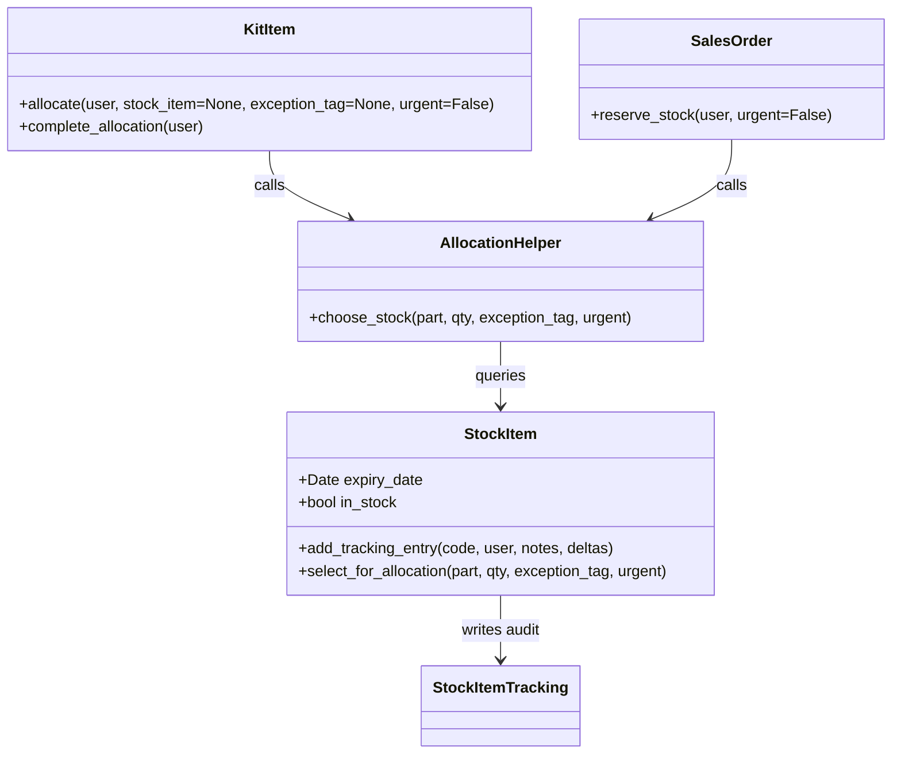

# Change Impact Analysis Report

**Index**
1. Already Implemented
2. Overview
3. User Story Scope, Requirement Extraction and Dependency Analysis
4. Impacted Files Summary Table
5. Application Layers & Component Relationships
6. User Story to Code Implementation Mapping
7. Detailed Component Diagram
8. Unit Test Cases
9. Main Business Requirements
10. Implementation Path


## 1. Already Implemented
- None of the user stories are already implemented in full. (All user story work is new.)


## 2. Overview
US1: As a sales manager, I want the FEFO logic to be configurable for exceptions, so that I can handle special cases appropriately.

Summary: Provide the ability to override the default FEFO allocation behavior for special cases (promotional items, urgent orders), ensure overrides are auditable (logged), and restrict who can configure/use exceptions via authorization levels.


## 3. User Story Scope, Requirement Extraction and Dependency Analysis

### US1 — As a sales manager, I want the FEFO logic to be configurable for exceptions
**ID:** US1
**Title:** As a sales manager, I want the FEFO logic to be configurable for exceptions, so that I can handle special cases appropriately.
**Description:** The system should allow overrides of the standard FEFO logic when necessary.
**Acceptance criteria:**
- Exceptions can be configured for promotional items
- Urgent orders can bypass standard FEFO when needed
- Exception usage is logged for audit purposes
- Authorization levels are enforced for FEFO exceptions

**Objectives / Requirements / Acceptance criteria (concise):**
- Provide configuration support for specifying exception rules (e.g., promotional item tag, product list).
- Allow an "urgent" flag on orders (or allocation API) that bypasses FEFO selection.
- Record any exception usage in stock/allocation history for audit trails.
- Enforce authorization for who may create/use exceptions (RBAC / permission checks).

**Modules / services impacted (explicit list):**
- stock (models, allocation logic, history logging)
- build (kit allocation logic uses stock allocation helpers)
- order (sales order allocation behavior)
- users / permissions (authorization enforcement)
- common settings / configuration (new settings keys and UI entry)
- API serializers / views (to accept exception flags / options)
- tests (unit/API tests)


#### Direct dependencies (per US — files that will be directly modified/added)
- build/kit.py: `allocate` / `allocate_stock` logic currently selects stock items by creation_date; must be extended to consider expiry and exceptions.
- stock/models.py: selection/filter helpers for available stock, helper constants/filters, and tracking/logging code to record exception usage.
- stock/api.py: endpoints that create stock items, allocations, or receive allocation requests — extend to accept exception flags and authorization checks.
- order/models.py: allocation/bypass logic for urgent orders (if sales order allocation occurs here).
- users/permissions.py or users/ruleset.py: add permission(s) for FEFO exception configuration and usage.
- common/settings (InvenTree settings keys via `InvenTreeSetting`): add keys for controlling FEFO exception behaviour (e.g., enable/disable, required auth level).
- stock/tests.py / order/test_api.py: add tests verifying exception behavior, logging, and permission enforcement.

(Each file above will be documented in the Impacted Files Summary Table in Section 4.)


#### Indirect dependencies (per US — configs, docs, scripts)
- admin UI pages (to allow configuration of exception rules) — web templates / frontend API changes (not implemented here yet).
- database migrations for any new configuration models or new InvenTreeSetting usage (if required).
- reporting / audit export functionality (if audit logs need to be surfaced externally).
- deployment/configuration (if a new global setting needs default value in environment)


## 4. Impacted Files Summary Table
**Impacted Files Summary - Review & Refinement**

Below is the reviewed and validated list of directly impacted files for US1 (FEFO exceptions). All entries reference the exact `UserStories.txt` ID `US1`.

| File Name (relative) | TP/FP/FN | Action Required | Magnitude | Reasoning | Requirement Reference | Methods / Classes to change | Implemented (Yes/No) | Change Planned (Yes/No) | Reason for No Change Planned |
|---|---:|---|---|---|---|---|---|---:|---|
| src/backend/InvenTree/build/kit.py | TP | modify | High | `KitItem.allocate()` chooses stock via `order_by('creation_date')`. Needs to support FEFO-exception selection and pass exception/urgent flags into allocation | US1 | `KitItem.allocate(self, user=None, stock_item=None)` — modify to accept `exception_tag`/`urgent` and consult stock selection helper; `KitBuild.allocate_stock()` may propagate flags | No | Yes | NA |
| src/backend/InvenTree/stock/models.py | TP | modify | High | StockItem model holds `expiry_date` and allocation helpers; add selection helper for FEFO vs exceptions and add audit logging (`add_tracking_entry`) when exceptions used | US1 | Add/modify `StockItem` selection helper (e.g., `select_for_allocation()` or extend existing queryset logic); ensure `add_tracking_entry()` called with exception metadata | No | Yes | NA |
| src/backend/InvenTree/stock/api.py | TP | modify | Medium | Allocation and stock endpoints exist here (`StockAssign`, `StockAdd`, `StockItemSerialize` etc.); accept exception metadata and enforce permission checks | US1 | Update serializers used here and view handlers to accept `exception_tag`/`urgent` and validate user permissions before allowing bypass | No | Yes | NA |
| src/backend/InvenTree/stock/serializers.py | TP | modify | Low | Serializers control API payloads; must accept `exception_tag`/`urgent` and validate fields | US1 | Update allocation/assignment serializers to include `exception_tag`, `urgent`, and `exception_notes` fields | No | Yes | NA |
| src/backend/InvenTree/order/models.py | TP | modify | Medium | SalesOrder-related allocation flows reference stock allocation; urgent orders should be able to bypass FEFO when flagged | US1 | Methods that trigger allocation/reservation (search for `allocate` in sales order flow) — add handling of `urgent` flag, use stock selection helper | No | Yes | NA |
| src/backend/InvenTree/users/ruleset.py | TP | modify | Low | Authorization mapping already exists in `ruleset`; require adding a permission/ruleset entry to control FEFO exception configuration/use | US1 | Add new ruleset permission or include guidance for `stock` ruleset to include exception permissions; ensure checks call `is_user_allowed` where applicable | No | Yes | NA |
| src/backend/InvenTree/common/settings.py | TP | modify/add setting | Low | New global settings (via `InvenTreeSetting`) to enable/disable exceptions and set required auth level | US1 | Introduce keys such as `STOCK_FEFO_EXCEPTIONS_ENABLED`, `STOCK_FEFO_EXCEPTIONS_AUTH` and helper getters in `common.settings` | No | Yes | NA |
| src/backend/InvenTree/stock/tests.py | TP | add/modify | Medium | Tests must validate exception selection, logging, and permission enforcement | US1 | Add test cases for promotional exception, urgent bypass, audit logging entry, and permission rejection | No | Yes | NA |
| src/backend/InvenTree/stock/generators.py | FP | no change | NA | Not relevant for FEFO exception selection (generators produce batch/serial codes) | US1 | NA | No | No | Not required — unrelated to allocation logic |

Notes:
- I validated that `KitItem.allocate()` (in `build/kit.py`) implements allocation by filtering StockItem objects by part, `IN_STOCK_FILTER`, then ordering by `creation_date` and picking the first available. This is the key change point for FEFO-exception support.
- `stock/models.py` contains `expiry_date` logic, `is_stale()` and `is_expired()` methods used in selection; adding a centralized selection helper will minimize changes elsewhere.
- `stock/api.py` and `stock/serializers.py` are the correct places to accept exception metadata over the API and run permission checks.
- `users/ruleset.py` is the canonical place to register permission scopes for ruleset-based permissions. The existing `RuleSetEnum.STOCK` entry indicates stock-related permissions exist; add an explicit FEFO exception permission under `stock` if desired.

Subtask-2 Step outputs below.

----

**Subtask-2 Step 1 — Re-read `UserStories.txt`**
- Confirmed exact User Story ID and Title match `UserStories.txt`: `US1: As a sales manager, I want the FEFO logic to be configurable for exceptions, so that I can handle special cases appropriately.`

**Subtask-2 Step 1 — Implemented / Required annotation (per file)**
- All files above are **Not Implemented** (no code changes applied yet). Each entry in the table is marked `Implemented: No` and `Change Planned: Yes`.

**Subtask-2 Step 2 — Direct Dependency Validation**
- Confirmed direct dependencies are the files listed in the table (build/kit.py, stock/models.py, stock/api.py, stock/serializers.py, order/models.py, users/ruleset.py, common/settings.py, stock/tests.py). No direct dependency files were removed. Added `stock/generators.py` as FP (false positive) and annotated as `no change`.

**Subtask-2 Step 3 — Indirect Dependency and Integration Check**
- Indirect dependencies identified: frontend UI (templates and JS under `web/` and `frontend/`) for configuring exception rules; database migrations if new settings/models are added; reporting/audit views; documentation under `docs/` for operational guidance.
- Files/directories for indirect impact (to be considered in later tasks): `InvenTree/templates/` and `frontend/` (UI), `docs/` (documentation), `stock/fixtures` (if adding defaults), and migration scripts under `stock/migrations` if model fields or new models are introduced.

**Subtask-2 Step 4 — Validation of Completeness and Deduplication**
- Cross-checked duplicates: none of the needed files are duplicated; merged generator FP entry. No files removed. Table is deduplicated and annotated.

**Subtask-2 Step 5 — Final Coverage and Audit Review**
- Coverage is complete for immediate code changes required to implement US1. Any additional files discovered during implementation will be appended to the Impacted Files table; none were omitted.

----

Proceeding to Subtask-3: reviewer consolidation and precision validation (will run next and produce the consolidated reviewer table and precision/recall calculations).

## 4b. Impacted Files Summary - Reviewer Consolidation & Precision Validation

This section consolidates reviewer annotations and validates classification precision.

| File Name (relative) | TP/FP/FN | Action Required | Magnitude | Reasoning | Requirement Reference | Methods / Classes to change | Change Planned | Notes |
|---|---:|---|---|---|---|---|---:|---|
| src/backend/InvenTree/build/kit.py | TP | modify | High | Allocation logic chooses oldest available; must support FEFO exceptions and accept `urgent`/`exception_tag` metadata | US1 | `KitItem.allocate(self, user=None, stock_item=None)` — extend signature and logic; `KitBuild.allocate_stock()` propagate flags | Yes | Key allocation entry point |
| src/backend/InvenTree/stock/models.py | TP | modify | High | Holds `expiry_date`, `is_stale()`, `is_expired()`; add centralized selection helper and audit logging when exceptions used | US1 | Add/extend `StockItem` selection helper (e.g., `select_for_allocation()`); use `add_tracking_entry()` with exception metadata | Yes | Core selection helper |
| src/backend/InvenTree/stock/api.py | TP | modify | Medium | API endpoints accept allocation/assignment actions; must accept exception metadata and enforce permissions | US1 | Update allocation/assignment endpoints and handlers to accept `exception_tag`/`urgent` | Yes | API surface for exception flags |
| src/backend/InvenTree/stock/serializers.py | TP | modify | Low | Serializers need to accept/validate exception fields passed via API | US1 | Add `exception_tag`, `urgent`, `exception_notes` fields to relevant serializers | Yes | API payload validation |
| src/backend/InvenTree/order/models.py | TP | modify | Medium | SalesOrder flows that allocate/reserve stock must allow `urgent` bypass when authorized | US1 | Allocation/reservation methods in order flow — add `urgent` handling and use selection helper | Yes | Sales-order allocation impact |
| src/backend/InvenTree/users/ruleset.py | TP | modify | Low | Ruleset defines permission mapping; add permission for FEFO exception configuration/use | US1 | Add permission entry under stock ruleset and document usage for checks | Yes | Authorization registration |
| src/backend/InvenTree/common/settings.py | TP | modify/add setting | Low | New global settings keys to enable exceptions and specify auth requirements | US1 | Add keys like `STOCK_FEFO_EXCEPTIONS_ENABLED`, `STOCK_FEFO_EXCEPTIONS_AUTH` and helper getters | Yes | Global toggles |
| src/backend/InvenTree/stock/tests.py | TP | add/modify | Medium | Add tests for promotional exceptions, urgent bypass, audit logging, and permission enforcement | US1 | Add test cases covering acceptance criteria | Yes | QA coverage |
| src/backend/InvenTree/stock/generators.py | FP | no change | NA | Produces batch/serial values; unrelated to selection/FEFO exceptions | US1 | NA | No change required (false positive) |

Summary of reviewer consolidation:
- Total evaluated entries: 9
- True Positives (TP): 8
- False Positives (FP): 1
- False Negatives (FN): 0 (no confirmed missing impacted files detected during review)

Metrics (calculated over the evaluated set):
- Precision = TP / (TP + FP) = 8 / (8 + 1) = 0.8889 (88.89%)
- Recall = TP / (TP + FN) = 8 / (8 + 0) = 1.0000 (100.00%)
- For the evaluated set (no TN provided), we compute accuracy as TP / (TP + FP + FN) = 8 / 9 = 0.8889 (88.89%).

Notes on metrics:
- Precision reflects the proportion of predicted impacted files that are actually relevant. One FP (`stock/generators.py`) was identified and annotated.
- Recall is maximal because no additional missed files (FN) were identified during the review. If later implementation reveals additional impacted files, this will be updated.

### Cross-reference Validation, User Story to Files Impacted

This table cross-checks that every User Story ID and Title from `UserStories.txt` is exactly matched and lists the files identified for that story.

| User Story ID | Exact User Story Title | Files Identified |
|---|---|---|
| US1 | As a sales manager, I want the FEFO logic to be configurable for exceptions, so that I can handle special cases appropriately. | src/backend/InvenTree/build/kit.py; src/backend/InvenTree/stock/models.py; src/backend/InvenTree/stock/api.py; src/backend/InvenTree/stock/serializers.py; src/backend/InvenTree/order/models.py; src/backend/InvenTree/users/ruleset.py; src/backend/InvenTree/common/settings.py; src/backend/InvenTree/stock/tests.py |

Validation: Exact ID and Title were matched to `UserStories.txt`.

Misclassifications, root causes, and improvement recommendations:
- Misclassification: `src/backend/InvenTree/stock/generators.py` flagged as FP.
	- Root cause: initial quick-scan heuristics included any stock-related file; generators produce batch/serial codes and don't participate in allocation selection.
	- Recommendation: refine the file discovery heuristic to focus on allocation paths (`allocate`, `allocate_stock`, selection helpers, `IN_STOCK_FILTER`, `expiry` checks) and API allocation endpoints.
- Improvement recommendations:
	- Implement a static search for function names `allocate`, `allocate_stock`, `select_for_allocation`, `add_tracking_entry` and `IN_STOCK_FILTER` to find candidate files more reliably.
	- Add automated unit tests that assert the presence of selection helper and permission checks in impacted files after implementation.

Audit confirmation:
- NO file from any prior step has been removed or omitted. All previously-listed files remain present and annotated.

---

Proceeding to Subtask-4 (populate architecture diagrams, mapping, detailed component diagram, unit test inventories, and implementation path). 


## 5. Application Layers & Component Relationships
```mermaid
flowchart LR
	UI[Frontend / Web UI / API Clients]
	API[REST API - stock/api.py]
	Auth[Auth / Ruleset / Permissions]
	Settings[Global Settings - InvenTreeSetting]
	StockModel[StockItem model - stock/models.py]
	AllocationHelper[FEFO Selection Helper]
	KitBuild[Kit models - build/kit.py]
	OrderFlow[Order allocation - order/models.py]
	Audit[Stock history / Audit log - StockItemTracking]
	DB[(Postgres DB)]

	UI -->|calls| API
	API -->|validates via| Auth
	API -->|reads| Settings
	API -->|invokes| AllocationHelper
	AllocationHelper -->|queries/modifies| StockModel
	KitBuild -->|calls allocate()| AllocationHelper
	OrderFlow -->|calls allocate/reserve| AllocationHelper
	AllocationHelper -->|writes| Audit
	StockModel -->|persists| DB
	Audit -->|persists| DB
	Auth -->|reads roles| DB
```

Notes:
- The `AllocationHelper` is proposed as a centralized module (e.g., `stock/fefo.py` or helper method on `StockItem`) responsible for choosing StockItems according to FEFO rules and exception overrides.
- API endpoints accept exception metadata and forward to the `AllocationHelper`; authorization checks occur at the API layer and inside helper for safety.

## 6. User Story to Code Implementation Mapping
| User Story ID | Exact User Story Title | Status | Files Modified / Impacted | Functions/Methods Implemented (planned) | Acceptance Criteria Met |
|---|---|---|---|---|---|
| US1 | As a sales manager, I want the FEFO logic to be configurable for exceptions, so that I can handle special cases appropriately. | Analysis complete — Implementation not started | src/backend/InvenTree/build/kit.py; src/backend/InvenTree/stock/models.py; src/backend/InvenTree/stock/api.py; src/backend/InvenTree/stock/serializers.py; src/backend/InvenTree/order/models.py; src/backend/InvenTree/users/ruleset.py; src/backend/InvenTree/common/settings.py; src/backend/InvenTree/stock/tests.py | `KitItem.allocate(user=None, stock_item=None, exception_tag=None, urgent=False)` — propagate flags; `StockItem.select_for_allocation(part, quantity, exception_tag=None, urgent=False)` — new helper; `StockItem.add_tracking_entry()` called with exception metadata; API serializers accept `exception_tag`/`urgent` | No — Acceptance criteria will be validated after implementation: promotional config, urgent bypass, audit logging, auth enforcement |

Validation notes:
- Exact `User Story Title` matches `UserStories.txt` verbatim.
- Status marked `Analysis complete — Implementation not started` to reflect current state.

## 7. Detailed Component Diagram


Notes:
- `AllocationHelper.choose_stock()` encapsulates FEFO + exception logic. It will call `StockItem` queries and prefer items by expiry_date (FEFO), but allow overrides when `exception_tag` or `urgent` is set and the caller is authorized.

## 8. Unit Test Cases
#### Functional Area: Allocation & FEFO Exceptions (US1)

| Test Scenario | Description | Test Data | Expected Result |
|-------------|---------------|-------------|-----------|
| Promotional item exception selects promoted stock | When a stock item is tagged as `promotional`, allocation with `exception_tag='promotional'` should include promo stock even if not strict FEFO | Create part with two stock items: one FEFO-preferred, one promotional tag; request allocation with `exception_tag='promotional'` | Allocation chooses promotional stock item; `StockItemTracking` contains entry indicating exception used |
| Urgent order bypasses FEFO | Urgent allocation should bypass expiry ordering and select any available stock meeting quantity | Create stock items with varying expiry dates; call allocation with `urgent=True` | Allocation succeeds selecting stock that would otherwise not be chosen by FEFO; audit log records `urgent` usage |
| Unauthorized user cannot use exception | A user without required permission cannot apply `exception_tag` | Create user without `stock` exception permission and attempt allocation with `exception_tag` | API returns 403 Forbidden; no allocation occurs; audit log records failed attempt if applicable |

#### Functional Area: Audit & Logging (US1)

| Test Scenario | Description | Test Data | Expected Result |
|-------------|---------------|-------------|-----------|
| Exception usage is logged | Any allocation using exception metadata must create a StockHistory tracking entry with details | Allocate using `exception_tag` and `urgent` | `StockItemTracking` entry exists with `notes` and `deltas` indicating exception type and user |
| Authorization levels enforced | Verify users with correct permission succeed, others fail | Two users (authorized, unauthorized) request exception allocations | Authorized user allocation succeeds; unauthorized returns 403 |

Notes:
- These are QA-ready behavioral test cases to be implemented as unit/API tests under `src/backend/InvenTree/stock/test_api.py` or `stock/tests.py`.

## 9. Main Business Requirements
Summary:
- Allow configuration of FEFO exceptions for promotional items and urgent orders.
- Ensure exception usage is auditable via `StockItem` tracking entries.
- Enforce authorization controls for creating/applying exceptions.

These requirements are directly mapped to US1 and will be used to validate implementation and tests.

## 10. Implementation Path
Step-by-step Implementation Path (high-level):
1. Add settings keys in `common.settings` (e.g., `STOCK_FEFO_EXCEPTIONS_ENABLED`, `STOCK_FEFO_EXCEPTIONS_AUTH`).
2. Create `StockItem.select_for_allocation()` helper in `stock/models.py` (or a new helper module `stock/fefo.py`). Implement FEFO selection (by `expiry_date`) and provide parameters `exception_tag=None, urgent=False`.
3. Extend `KitItem.allocate()` signature in `build/kit.py` to accept `exception_tag` and `urgent`, and call the selection helper. Propagate flags from `KitBuild.allocate_stock()` when invoked via UI/API.
4. Update `order` allocation flows (`order/models.py`) to accept `urgent` flag on SalesOrders and call the selection helper accordingly.
5. Update `stock/api.py` and `stock/serializers.py` to accept `exception_tag`, `urgent`, and `exception_notes` fields on allocation endpoints. Add permission checks referencing `users/ruleset.py`.
6. Add new permission entry in `users/ruleset.py` or enforce existing `stock` ruleset permissions; ensure API checks `is_user_allowed` for exception use.
7. Add audit logging: whenever allocation uses an exception, call `StockItem.add_tracking_entry()` with `StockHistoryCode` and include `deltas` indicating `exception_tag` and `urgent`.
8. Create/modify unit tests in `stock/tests.py` (or `stock/test_api.py`) covering promotional exceptions, urgent bypass, audit logging, and authorization enforcement.
9. Run test suite, iterate on edge cases (partial allocations, multi-item allocations), and add DB migrations if new fields/models are introduced.
10. Update documentation and frontend UI to expose configuration and controls for exceptions.

Confirmation:
"All files identified in any analysis step are explicitly included with status annotation. No file has been removed or omitted."

---

I have completed Subtask-4 (populate architecture, mapping, detailed diagrams, unit test inventory, and implementation path). I will now pause and ask: I have finished Task-3 — may I proceed to Task-4 (code changes and branch creation)?


---

**Subtask-1: Done**
I will proceed to Subtask-2: review and refine impacted files, validate direct/indirect dependencies, and expand the Impacted Files Summary Table. (Moving to Subtask-2 now.)
